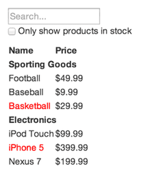

# Exercices React sur grafikart

## 01. Convertisseur Celcius Farheneit

C'est un exemple qui est present dans la Documentation de React, et notre objectif est un systeme dans lequel on va:

- Pouvoir rentrer une temperature et
- Qui va nous dire si l'eau elle bou ou non
- Ajouter un system qui permet de convertir des degrès __Celcius__ en __Farheneit__

## 02. Liste de produit

Dans cet exercices on va voir comment reflechir et morceler nos composant lorsque l'on travaille avec React.
L'exercice a un principe très simple, on va avoir une liste des produits qui proviennent d'une API, et trier par categorie et notre idée est de presenter cette liste de cette maniere:

On aura aussi en haut un petit formulaire qui permettre de filtrer les produits en se basant sur leurs __noms__ et qui permettra d'afficher que les produits qui sont en stocks quand on coche le checkbox
, lorsque un produit n'est pas en stock il apparaitra en rouge

Lorsque l'on a ces genres d'exercices à faire il faut toute de suite reflechir à comment l'on va decomposer et quel composant on va utiliser au niveau de notre application

Si l'on reflechis selon l'image, on a deux composant principaux dans cet interface:

- On a un premier composant qui va etre le formulaire de recherche , c'est lui qui va permettre de filtrer et qui va permettre d'afficher que les produits en stock
- En dessours on aura la liste des produits, pour cette liste des produits on a aura deux composants, un composant qui permettra d'afficher les categories et un composant qui permettra d'afficher individuellement chacun des produits

La derniere etape qu'il faut faire c'est de savoir comment est-ce que l'on va gerer l'Etat, est-ce que certains composant vont avoir un Etat interne, et est-ce que certains composant vont recevoir des propriéter

- La première idée c'est de se dire bon, de maniere génerale quel est l'etat dont on a besoin ?
  - On a besoin d'un etat principale qui sera la liste des produits et le composant qui va etre charger d'obtenir cette liste c'est le composant principale
  - Le composant formulaire n'a pas besoin d'avoir grand chose, il a juste besoin de savoir quand est-ce que l'on va changer le filtrer et recherche et quand est-ce que on va cocher la petite case dont il n'est pas nécessaire qu'il est un Etat particulier, il recevra simplement des proprieter et il fera remonter les filtres et l'etat de coching de la checkbox au composant parent
  - Le composant en vert n'as pas besoin d'un etat particulier, n'as pas besoin d'un etat particulier, on va lui passer des proprieter, donc on lui passera la liste des produits et les différents filtres à appliquer et automatiquement il affichera les choses
